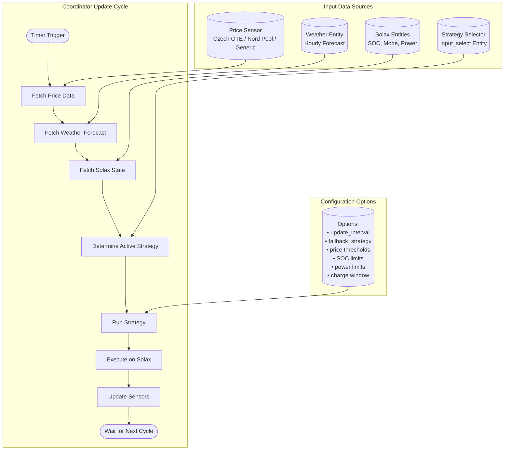
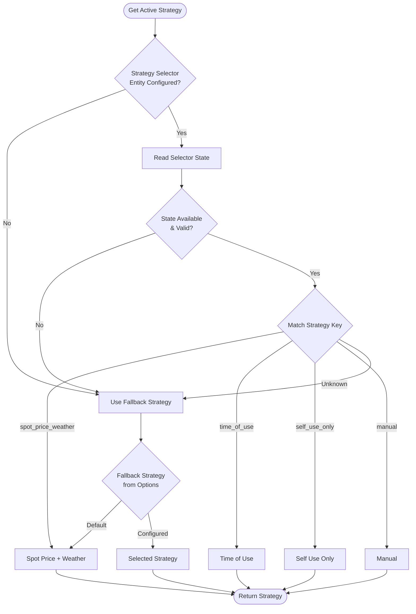
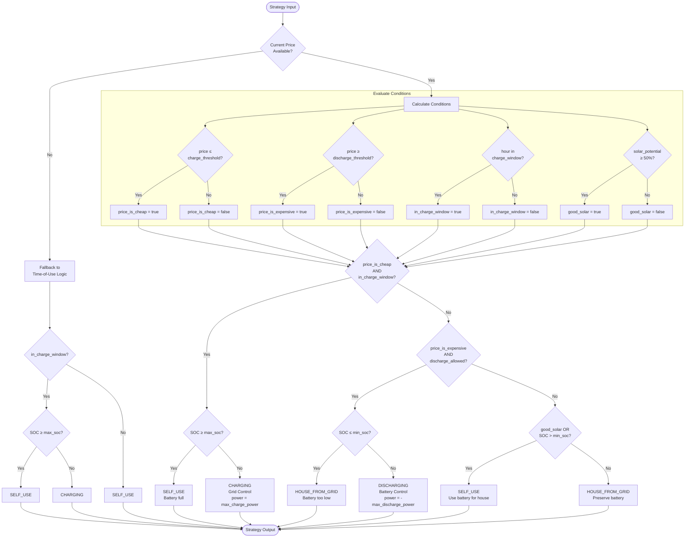
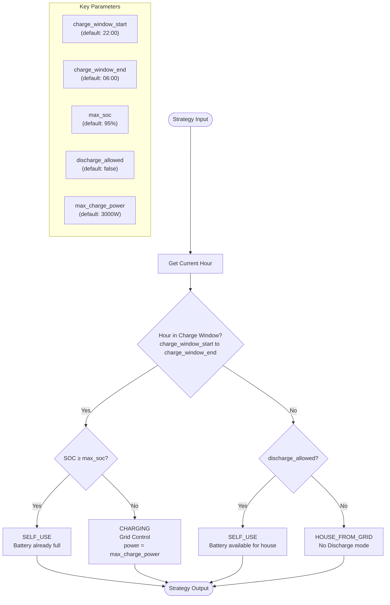
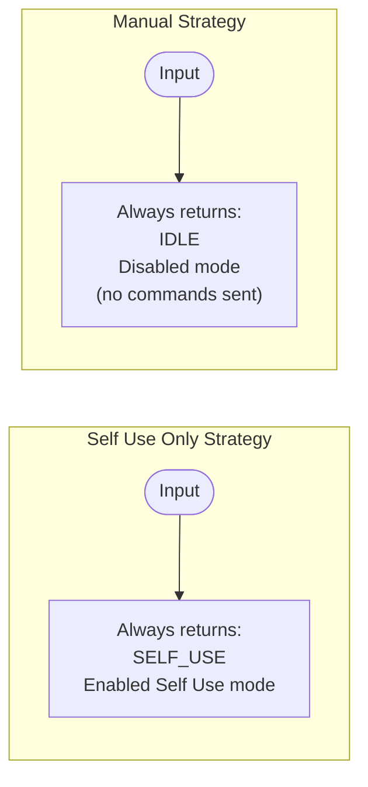
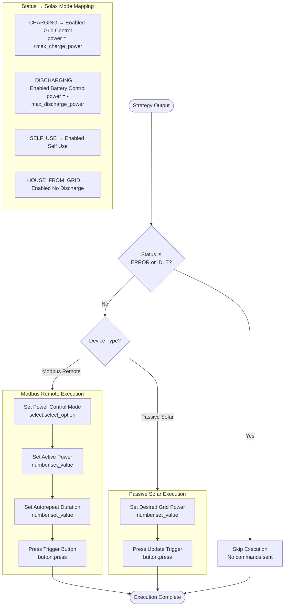
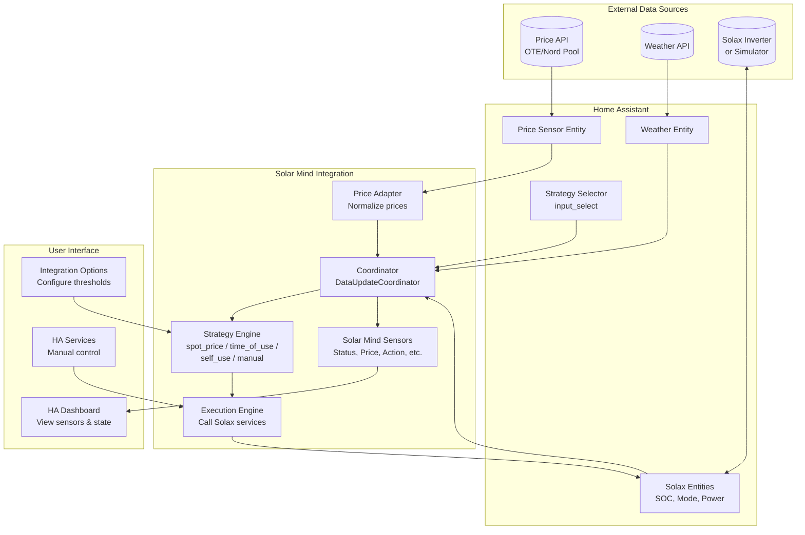
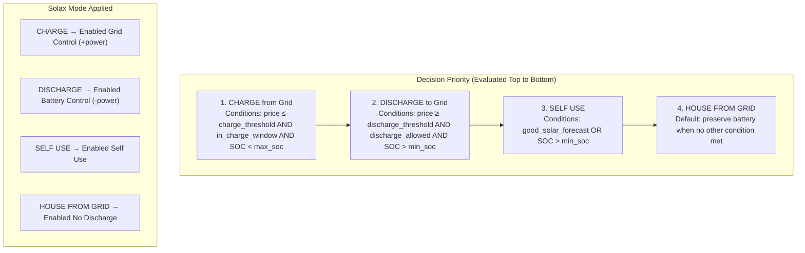

# Documentation for Home Assistant Developers

This document is aimed at **senior Python developers** who are new to the Home Assistant integration ecosystem. It explains how custom components work in Home Assistant, how this project is structured, the entities and concepts used, and how solar PV/battery systems and Solax inverters fit in—so you can extend or maintain the codebase with confidence.

---

## Table of Contents

1. [Home Assistant Custom Integrations (Concepts)](#1-home-assistant-custom-integrations-concepts)
2. [Key Home Assistant APIs Used in This Project](#2-key-home-assistant-apis-used-in-this-project)
3. [Project Structure and Components](#3-project-structure-and-components)
4. [Entities in This Project](#4-entities-in-this-project)
5. [Solar Plant and Inverter Concepts](#5-solar-plant-and-inverter-concepts)
6. [Solax Entities: What They Are and What They Do](#6-solax-entities-what-they-are-and-what-they-do)
7. [How Solar Charging Works in This Project](#7-how-solar-charging-works-in-this-project)
8. [Decision Flow Charts](#8-decision-flow-charts)
9. [Further Reading](#9-further-reading)

---

## 1. Home Assistant Custom Integrations (Concepts)

### What is a custom integration?

A **custom integration** (or “custom component”) is a Python package that lives under `config/custom_components/<domain>/` and is loaded by Home Assistant at startup. It can:

- Add new **integrations** (configured via UI or YAML)
- Expose **entities** (sensors, switches, numbers, selects, buttons, etc.)
- Register **services** that automations and scripts can call
- Use **config entries** (stored configuration per “instance” of the integration)

The **domain** is a short, unique identifier (e.g. `solar_mind`, `solax_pv_simulator`). All entities from that integration are typically prefixed by the domain (e.g. `sensor.solar_mind_status`).

### Manifest: identity and requirements

Every custom integration **must** have a `manifest.json` in its folder. It declares:

| Key | Purpose |
|-----|---------|
| `domain` | Unique ID; must match the folder name |
| `name` | Human-readable name in the UI |
| `version` | Semantic version (required for custom components) |
| `documentation` | Link to docs |
| `issue_tracker` | Link to issue tracker |
| `config_flow` | If `true`, setup is done via UI (no YAML required) |
| `iot_class` | e.g. `local_polling`, `cloud_polling`—hints how the integration talks to devices/APIs |
| `integration_type` | e.g. `hub`, `device`, `service` |
| `requirements` | Pip dependencies |
| `dependencies` | Other HA integrations that must load first |
| `after_dependencies` | Integrations that should be loaded before this one (e.g. `input_select`) |

Example from this project (`solar_mind/manifest.json`):

```json
{
  "domain": "solar_mind",
  "name": "Solar Mind",
  "config_flow": true,
  "iot_class": "local_polling",
  "integration_type": "hub",
  "after_dependencies": ["input_select"]
}
```

**Official reference:** [Creating an integration manifest](https://developers.home-assistant.io/docs/creating_integration_manifest)

### Entry point: `__init__.py`

Home Assistant looks for:

- `async_setup(hass, config)` — called when the integration is loaded (e.g. from `configuration.yaml` or when first used). Used to set up the domain and optionally register handlers.
- `async_setup_entry(hass, entry)` — called for **each config entry** (one “instance” of the integration). Here you create your coordinator/simulator, store it in `hass.data[DOMAIN][entry.entry_id]`, and forward setup to **platforms** (sensor, number, etc.).

Unload is done in `async_unload_entry`: tear down platforms and remove the entry from `hass.data`.

**Official reference:** [Integration file structure](https://developers.home-assistant.io/docs/creating_integration_file_structure)

### Config flow (UI setup)

If `config_flow: true`, users add the integration via **Settings → Devices & Services → Add Integration**. The flow is implemented in `config_flow.py` by a class that subclasses `config_entries.ConfigFlow` and implements steps like `async_step_user`, `async_step_xxx`. Each step can show a form (`async_show_form`) or create the config entry (`async_create_entry`). Data is stored in the **config entry** (`entry.data`, `entry.options`); options can be changed later via the integration’s “Configure” dialog.

**Official reference:** [Config entries and config flow](https://developers.home-assistant.io/docs/config_entries_config_flow_handler)

### Platforms and entities

A **platform** is a module that adds one type of entity: `sensor`, `number`, `select`, `button`, etc. In `__init__.py`, after creating the “hub” (coordinator or simulator), we call:

```python
await hass.config_entries.async_forward_entry_setups(entry, PLATFORMS)
```

where `PLATFORMS` is e.g. `[Platform.SENSOR]`. For each platform, Home Assistant loads `sensor.py` (or `number.py`, etc.) and calls:

```python
async def async_setup_entry(hass, entry, async_add_entities):
    ...
    async_add_entities(entities)
```

So the integration creates entity instances and passes them to HA; HA then registers them in the entity registry and shows them in the UI. Entities are identified by `entity_id` (e.g. `sensor.solar_mind_status`) and, for stability, by `unique_id` (e.g. `{entry_id}_{sensor_key}`).

**Official reference:** [Integration platforms](https://developers.home-assistant.io/docs/creating_platform_index)

### Data flow: coordinator vs direct updates

- **DataUpdateCoordinator:** One place fetches data on an interval; entities subscribe to the coordinator and get the same data. Good for shared, periodic updates (e.g. price + weather + Solax state).
- **Direct updates:** The “hub” (e.g. simulator) holds state and notifies listeners when it changes; entities register a callback and call `async_write_ha_state()` when notified.

This project uses **SolarMindCoordinator** (DataUpdateCoordinator) for Solar Mind and **SolaxSimulator** (custom object with listeners) for the Solax PV Simulator.

**Official reference:** [Fetching data (DataUpdateCoordinator)](https://developers.home-assistant.io/docs/integration_fetching_data)

### Services

Custom integrations can register **services** under their domain (e.g. `solar_mind.charge_battery_from_grid`). Definitions go in `services.yaml` (schema and descriptions); registration and implementation are in Python (e.g. `services.py`), using `hass.services.async_register(DOMAIN, "service_name", callback, schema)`. Services can be called from Developer Tools, automations, and scripts.

---

## 2. Key Home Assistant APIs Used in This Project

| Concept | Where used | Link / note |
|--------|-------------|-------------|
| **Config entry** | `config_flow.py`, `__init__.py`, coordinator, platforms | `ConfigEntry` holds `entry_id`, `data`, `options` |
| **DataUpdateCoordinator** | `solar_mind/coordinator.py` | [Fetching data](https://developers.home-assistant.io/docs/integration_fetching_data) |
| **CoordinatorEntity** | `solar_mind/sensor.py` | Entities that take data from coordinator |
| **SensorEntity, SensorEntityDescription** | `solar_mind/sensor.py`, `solax_pv_simulator/sensor.py` | [Sensor](https://developers.home-assistant.io/docs/core/entity/sensor/) |
| **SelectEntity, NumberEntity, ButtonEntity** | Solax simulator | Select / Number / Button platforms |
| **DeviceInfo** | All entity modules | Ties entities to a “device” in the device registry |
| **EntitySelector, selector.NumberSelector** | `config_flow.py` | UI for choosing entities or numeric options in config flow |
| **hass.states.get(entity_id)** | Coordinator | Read current state of any entity |
| **hass.services.async_call(domain, service, data)** | Coordinator, services | Call HA services (e.g. `select.select_option`, `number.set_value`, `button.press`) |

Other useful docs:

- [Entity naming](https://developers.home-assistant.io/docs/entity_registry_index/#entity-naming) — `has_entity_name`, device vs entity name
- [Entity properties](https://developers.home-assistant.io/docs/core/entity) — `unique_id`, `device_class`, `state_class`, `native_value`, `extra_state_attributes`

---

## 3. Project Structure and Components

```
custom_components/
├── solar_mind/           # Optimization logic: when to charge/discharge from grid
│   ├── __init__.py       # Entry point, setup_entry, platforms, services
│   ├── config_flow.py    # UI setup and options
│   ├── const.py          # Domain, config keys, defaults, enums (StrategyKey, SystemStatus, Solax modes)
│   ├── coordinator.py    # DataUpdateCoordinator: fetch prices/weather/Solax, run strategy, execute Solax
│   ├── models.py         # PriceData, SolaxState, StrategyInput/Output, SolarMindData
│   ├── price_adapter.py  # Normalize Czech OTE / Nord Pool / generic price sensors
│   ├── sensor.py         # Solar Mind sensor platform (status, price, strategy, etc.)
│   ├── services.py       # Register and handle solar_mind.* services
│   ├── services.yaml     # Service definitions
│   └── strategies/       # Strategy implementations (spot price, time-of-use, self-use, manual)
└── solax_pv_simulator/   # Simulated Solax inverter for testing
    ├── __init__.py       # Setup entry, create simulator, platforms, services
    ├── config_flow.py    # UI: battery capacity, max power, etc.
    ├── const.py          # Domain, sensor/select/number/button keys, modes, weather
    ├── simulator.py      # Wraps SimulatorCore, HA timer, listener registration
    ├── simulator_core.py # Pure logic: PV curve, house load, power flow, battery SOC
    ├── sensor.py, select.py, number.py, button.py  # Entity platforms
    ├── services.py       # Simulator services (set weather, SOC, house load, etc.)
    └── services.yaml     # Service definitions
```

- **Solar Mind** does not talk to hardware directly. It reads **entities** (price sensor, weather, Solax entities) and writes **entities** (Solax select/number/button) to control the inverter. So it works with a real Solax integration or with the **Solax PV Simulator**.
- **Solax PV Simulator** mimics a Solax inverter: same entity types and behaviors, so you can develop and test Solar Mind without real hardware.

---

## 4. Entities in This Project

### 4.1 Solar Mind entities (sensors)

All are under the same device (integration instance). Each sensor is built from `SolarMindData` provided by the coordinator.

| Entity ID (pattern) | Description |
|--------------------|-------------|
| `sensor.solar_mind_status` | Current system status: `charging`, `discharging`, `self_use`, `house_from_grid`, `idle`, `error`. Attributes: `mode`, `reason`, `power_w`, `duration_seconds`, `battery_soc` |
| `sensor.solar_mind_recommended_action` | Human-readable recommendation (e.g. “Charge from grid at 3000W”) |
| `sensor.solar_mind_current_price` | Current spot price (e.g. CZK/kWh). Attributes: `tomorrow_available`, `min_today`, `max_today`, `current_rank`, `total_hours` |
| `sensor.solar_mind_active_strategy` | Active strategy name (from selector or fallback) |
| `sensor.solar_mind_strategy_mode` | Strategy decision string (e.g. `charging_3000w`) |
| `sensor.solar_mind_next_cheap_hour` | Next hour (HH:MM) when price is among cheapest. Attributes: `cheap_hours`, `next_start`, `next_price` |
| `sensor.solar_mind_cheapest_hours_today` | Comma-separated hours (e.g. “2, 3, 4, 5, 6, 7”). Attributes: `hours` (list of {hour, price}) |
| `sensor.solar_mind_last_update` | Last coordinator update (timestamp) |
| `sensor.solar_mind_next_action` | Reason for current action |
| `sensor.solar_mind_battery_soc` | Battery SOC from last Solax read (%) |
| `sensor.solar_mind_last_error` | Last error message (diagnostic; disabled by default in entity registry) |

### 4.2 Solax PV Simulator entities

The simulator exposes the same kinds of entities a real Solax Modbus integration would, so Solar Mind can target them.

**Sensors** (read-only state):

| Key / entity | Description |
|--------------|-------------|
| `battery_soc` | Battery state of charge (%) |
| `battery_power` | Battery power (W); positive = charging, negative = discharging |
| `battery_temperature` | Battery temperature (°C) |
| `pv_power` | PV production (W) |
| `pv_voltage`, `pv_current` | PV DC voltage (V) and current (A) |
| `grid_power` | Grid power (W); positive = import, negative = export |
| `grid_voltage`, `grid_frequency` | Grid voltage (V) and frequency (Hz) |
| `house_load` | House consumption (W) |
| `inverter_temperature` | Inverter temperature (°C) |
| `energy_today`, `energy_total` | Energy (kWh) today and total |

**Select:**

| Key / entity | Description |
|--------------|-------------|
| `remotecontrol_power_control` | Remote control mode: Disabled, Enabled Grid Control, Enabled Battery Control, Enabled Self Use, Enabled No Discharge, Enabled Feedin Priority |
| `energy_storage_mode` | Energy storage mode: Self Use, Feed In Priority, Backup, Manual |

**Number:**

| Key / entity | Description |
|--------------|-------------|
| `remotecontrol_active_power` | Active power setpoint (W) for grid/battery control |
| `remotecontrol_autorepeat_duration` | Duration (s) after which the command repeats or reverts |
| `passive_desired_grid_power` | (Passive/Sofar) Desired grid power (W) |

**Button:**

| Key / entity | Description |
|--------------|-------------|
| `remotecontrol_trigger` | Apply current remote control settings (mode + power + duration) |
| `passive_update_battery_charge_discharge` | (Passive) Apply desired grid power |

Solar Mind (or a user) sets the select/number and then presses the trigger button so the inverter applies the new mode and power.

---

## 5. Solar Plant and Inverter Concepts

### 5.1 Parts of a typical solar + battery system

- **PV array:** Solar panels produce DC power. Yield depends on irradiance (time of day, weather).
- **Inverter:** Converts DC (PV and often battery) to AC, connects to **grid** and **house**. It can also convert AC to DC to charge the battery from the grid.
- **Battery:** Stores energy (Wh/kWh). **State of charge (SOC)** is the fill level (0–100%).
- **Grid:** Utility connection. **Import** = power from grid to house/battery; **export** = power from house/PV/battery to grid.
- **House load:** Power consumed by the home (W or kW). Must be supplied by PV, battery, or grid.

So at any moment:  
**PV production + battery discharge + grid import = house load + battery charge + grid export** (with losses).

### 5.2 Power and energy

- **Power (W, kW):** Instantaneous flow. Positive = into battery or into house; sign conventions depend on context (e.g. grid: positive = import).
- **Energy (Wh, kWh):** Energy over time (power × time). Used for totals (e.g. energy today, energy total).
- **SOC (%):** Percentage of battery capacity currently stored. Bounded by inverter/BMS (e.g. 10–95%).

### 5.3 Charge and discharge limits

Inverters/batteries have:

- **Max charge power (W):** How fast the battery can be charged (from PV or grid).
- **Max discharge power (W):** How fast the battery can supply the house or export to grid.

The integration respects these (and optional min/max SOC) when deciding charge/discharge setpoints.

### 5.4 Operating modes (high level)

- **Self-use:** Priority is to use PV for house and battery; grid fills the gap. Typically no or limited export; battery used for house at night.
- **Charge from grid:** Grid is used to charge the battery (e.g. at cheap rate or when solar is low).
- **Discharge to grid:** Battery (and/or PV) is sent to the grid (e.g. when selling price is high).
- **No discharge / house from grid:** House is supplied from grid; battery is preserved (no discharge).

Strategies in this project map to these intents and then to Solax remote control modes.

---

## 6. Solax Entities: What They Are and What They Do

Real Solax integrations (e.g. Solax Modbus) expose **select**, **number**, and **button** entities to control the inverter. Solar Mind (and the simulator) use the same contract.

### 6.1 Remote control modes (Solax “Power Control” select)

This is the main lever: *how* the inverter uses PV, battery, and grid.

| Mode | Meaning |
|------|--------|
| **Disabled** | Remote control off; inverter uses its own logic (e.g. self-use). |
| **Enabled Grid Control** | Inverter tries to achieve a **grid power setpoint** (W). Positive = import, negative = export. Used to *charge from grid* (positive setpoint) or *export* (negative). |
| **Enabled Battery Control** | Inverter tries to achieve a **battery power setpoint** (W). Positive = charge, negative = discharge. Used to charge or discharge the battery to a target power. |
| **Enabled Self Use** | Classic self-consumption: PV → house and battery; battery → house when needed; grid fills the rest. No intentional export. |
| **Enabled No Discharge** | Battery is not discharged; house can use PV and grid. Used to “preserve” battery. |
| **Enabled Feedin Priority** | Priority to feed surplus to grid (PV/battery export). |

Solar Mind sets **Grid Control** for grid charging (positive power) and **Battery Control** for discharging to grid (negative battery power), and **Self Use** / **No Discharge** for the corresponding behaviors.

### 6.2 Active power and duration

- **Remote Control Active Power (number):** Setpoint in W. Meaning depends on mode: for Grid Control = desired grid power; for Battery Control = desired battery power (positive = charge, negative = discharge).
- **Autorepeat duration (number):** How long (seconds) the command is applied before the inverter may revert (e.g. back to self-use) or repeat. Solar Mind sets this so the inverter doesn’t need a new trigger every minute.

### 6.3 Trigger button

After changing the **select** (mode) and **number(s)** (power, duration), something must tell the inverter to **apply** the new settings. That’s the **Remote Control Trigger** button. Solar Mind (and the simulator) call `button.press` on that entity after updating select and numbers.

### 6.4 Battery SOC and optional entities

- **Battery SOC (sensor):** Read-only. Used by Solar Mind to know current level and respect min/max SOC in strategies.
- **Energy storage mode (select):** Higher-level mode (Self Use, Feed In Priority, Backup, Manual). Optional in config; Solar Mind focuses on the **remote control power control** select and power/duration/trigger.

### 6.5 Passive mode (Sofar)

Some inverters (e.g. Sofar in passive mode) don’t use the same select/trigger; they expose a **desired grid power** number and a **button** to apply it. Solar Mind supports this via `passive_desired_grid_power` and `passive_update_trigger` in config; the logic is the same (set power, then trigger).

---

## 7. How Solar Charging Works in This Project

### 7.1 Data flow (Solar Mind)

1. **Coordinator** runs periodically (e.g. every 5 minutes) and in `_async_update_data`:
   - **Fetches prices** from the configured price sensor (Czech OTE, Nord Pool, or generic) via `price_adapter`.
   - **Fetches weather** from the configured weather entity (hourly forecast) for solar potential.
   - **Fetches Solax state** (battery SOC, current mode, active power) from the configured Solax entities.
   - **Resolves active strategy** from the strategy selector entity (or fallback option).
   - **Runs the strategy** with `StrategyInput` (time, prices, weather, Solax state, options) and gets `StrategyOutput` (status, mode, power_w, duration_seconds, reason).
   - **Executes** the output: calls Solax select/number/button services (or passive number/button) to apply the recommended mode and power.
2. **Sensors** read from `coordinator.data` (`SolarMindData`) and expose status, price, strategy, next cheap hour, SOC, etc.

So: **read entities → run strategy → write entities**. No direct hardware access.

### 7.2 Strategies (what they decide)

- **Spot price + weather:** Charge from grid when price &lt; charge threshold (and in charge window); discharge to grid when price &gt; discharge threshold (if allowed); prefer self-use when solar forecast is good; otherwise preserve battery (e.g. house from grid).
- **Time of use:** Charge in a fixed time window (e.g. night); outside the window, self-use or no discharge.
- **Self use only:** Always command Self Use mode; no grid charge or discharge.
- **Manual:** Strategy still runs (so sensors update), but execution can be disabled or user drives behavior via services.

Strategy output is translated into a **Solax mode** (e.g. Grid Control, Battery Control, Self Use, No Discharge) and optional **power_w** and **duration_seconds**, then applied via entities.

### 7.3 Execution on Solax (Modbus remote)

For each update, when the strategy says “charge” or “discharge” or “self-use”, the coordinator:

1. Calls `select.select_option` on **Remote Control Power Control** with the chosen mode.
2. If power is set: calls `number.set_value` on **Remote Control Active Power** (and optionally **Autorepeat Duration**).
3. Calls `button.press` on **Remote Control Trigger**.

The inverter then applies that mode and setpoint until the duration expires or a new command is sent.

### 7.4 Simulator vs real inverter

- **Solax PV Simulator** implements the same entity interface and the same modes (Grid Control, Battery Control, Self Use, etc.) and power flow logic (PV curve, house load, battery SOC). So Solar Mind behaves the same in tests: it reads simulator entities and calls the same select/number/button services.
- **Real Solax** (e.g. Modbus): same entity IDs and service calls; only the backend is the real inverter instead of `simulator_core`.

---

## 8. Decision Flow Charts

This section provides visual flowcharts to help you understand how Solar Mind makes decisions about when to charge, discharge, or use self-use mode. These diagrams show exactly which parameters influence each decision.

### 8.1 High-Level Coordinator Update Cycle

Every update cycle (default: 5 minutes), the coordinator fetches data and executes the strategy:



### 8.2 Strategy Selection Flow

How the active strategy is determined from the selector entity or fallback:



### 8.3 Spot Price + Weather Strategy Decision Flow

This is the main optimization strategy. It uses prices, weather, time, and battery state to make decisions:



### 8.4 Spot Price Strategy - Parameter Reference

Key parameters that determine the Spot Price + Weather strategy decisions:

| Parameter | Config Key | Default | Effect on Decision |
|-----------|------------|---------|-------------------|
| **Charge Price Threshold** | `charge_price_threshold` | 0.05 | If current_price ≤ threshold → eligible for charging |
| **Discharge Price Threshold** | `discharge_price_threshold` | 0.15 | If current_price ≥ threshold → eligible for discharging |
| **Charge Window Start** | `charge_window_start` | 22 (10 PM) | Charging only allowed from this hour |
| **Charge Window End** | `charge_window_end` | 6 (6 AM) | Charging only allowed until this hour |
| **Min SOC** | `min_soc` | 10% | Battery won't discharge below this level |
| **Max SOC** | `max_soc` | 95% | Battery won't charge above this level |
| **Discharge Allowed** | `discharge_allowed` | false | Must be true to sell to grid |
| **Max Charge Power** | `max_charge_power` | 3000W | Power setpoint for charging |
| **Max Discharge Power** | `max_discharge_power` | 3000W | Power setpoint for discharging |

### 8.5 Time of Use Strategy Decision Flow

A simpler strategy based only on time windows, ignoring spot prices:



### 8.6 Self-Use Only and Manual Strategies

These are simple strategies with minimal decision logic:



### 8.7 Strategy Output to Solax Execution Flow

How the strategy output is translated into Solax commands:



### 8.8 Complete System Flow Overview

End-to-end flow showing all major components:



### 8.9 Decision Priority Summary

The Spot Price + Weather strategy evaluates conditions in this priority order:



---

## 9. Further Reading

- **Home Assistant developer docs:** [developers.home-assistant.io](https://developers.home-assistant.io/)
- **Creating an integration:** [Creating your first integration](https://developers.home-assistant.io/docs/creating_component_index/)
- **Integration structure:** [Integration file structure](https://developers.home-assistant.io/docs/creating_integration_file_structure)
- **Config flow:** [Config entries config flow handler](https://developers.home-assistant.io/docs/config_entries_config_flow_handler)
- **Fetching data / coordinator:** [Integration fetching data](https://developers.home-assistant.io/docs/integration_fetching_data)
- **Entity concepts:** [Core entity](https://developers.home-assistant.io/docs/core/entity)
- **Solax Modbus (community):** e.g. [homeassistant-solax-modbus](https://github.com/wills106/homeassistant-solax-modbus) — real inverter entities this project is designed to work with.

This doc should give you a clear mental model of Home Assistant custom integrations, how this repo is structured, what each entity is for, how solar and Solax concepts map to modes and setpoints, and how Solar Mind drives solar charging and discharging through entities and strategies.
